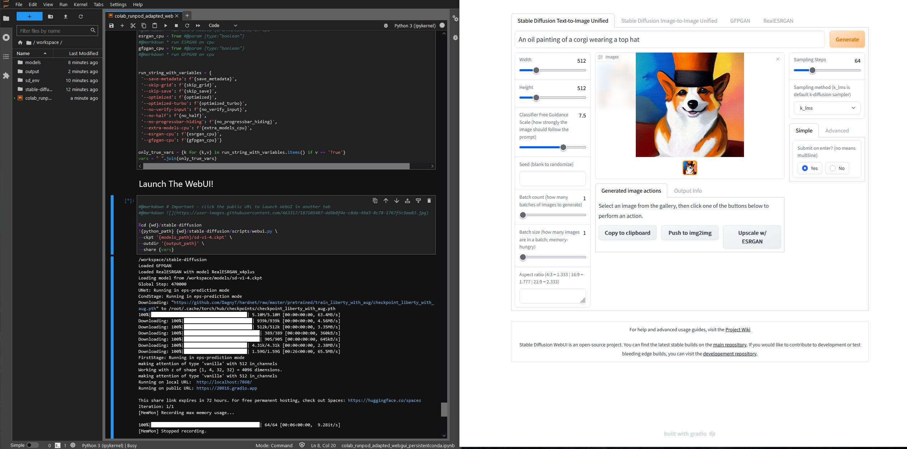

# StableDiffusion AI image generation web-app for GPU clouds
## What is this?
This repository contains code for running the stablediffusion gradio web ui (including ESRGAN+GFPGAN) on RunPod or similar GPU services. This is an incredibly powerful way to generate and refine images and art using text and image prompts. The notebook linked below can be run end-to-end to get a working WebUI for Stable Diffusion with support for face correction (GFPGAN) and superresolution upscaling (ESRGAN).

## How do I run it?
Code is contained in [the linked iPython Notebook](stablediffusion_runpod_adapted_webgui.ipynb) which can be run directly in JupyterLab locally, on the cloud, or on RunPod or similar cloud providers. The notebook comes preconfigured for runpod but can be trivially adapted to any other environment by changing a couple variables.

### Dependencies
All of these dependencies should come preinstalled when running on commodity GPU services (such as RunPod, LambdaLabs, Colab, SageMaker) or using pre-built deep learning VMs in cloud providers (such as AWS/GCP/Azure). You'll need to have the following available when the notebook runs:
- jupyterlab
- CUDA
- conda/miniconda

## Why use a public cloud provider?
I chose [RunPod](https://www.runpod.io) because it's the cheapest way I've found to get GPU time on powerful GPUs, often costing less than 1/3 of other major cloud providers. If running on RunPod, I built this based on the RunPod Pytorch container. That said, this notebook does not make use of the built-in preinstalled pytorch or conda environment as version/dependency incompatibilities between the preinstalled packages and the ones needed by the pipeline make it much easier to start fresh. 

This is also generally cheaper than DALL-E and similar managed services. DALL-E costs $15 for 115 images, and while relatively easy to use is not very customizable. With this notebook and an appropriate GPU, you can generate that many images in a few minutes for less than $1.

## Persistence?
This notebook is designed to create a persistent conda environment and model files in the `/workspace/` directory, which persists across stopping and starting pods so you don't have to redownload and reinstall everything every time you start a new runtime. It could easily be modified to use any similar persistent storage in other services (e.g. a google drive mount in colab).

## Tips
Ensure you're on a GPU with the appropriate VRAM for what you're trying to generate. GPUs with 16GB or less VRAM will probably only be able to generate a single 512x512 image at a time. Larger GPUs like the A100 are recommended but definitely more expensive.

## Credits
This notebook is based off a similar colab notebook by Altryne and the amazing Stable Diffusion webui. Go support them!
- https://github.com/altryne/sd-webui-colab
- https://github.com/hlky/stable-diffusion
